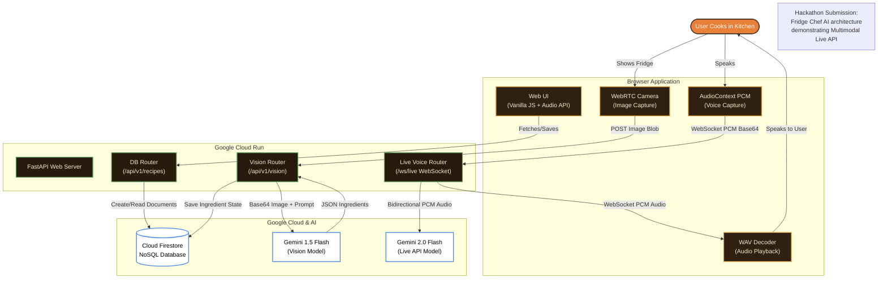

```mermaid
graph TD
    %% Styling
    classDef user fill:#e8803a,stroke:#4a3220,stroke-width:2px,color:#fff
    classDef frontend fill:#2f2010,stroke:#d4973a,stroke-width:2px,color:#f5e8d0
    classDef backend fill:#261a0d,stroke:#6aac6a,stroke-width:2px,color:#f5e8d0
    classDef google fill:#ffffff,stroke:#4285F4,stroke-width:2px,color:#000

    %% User Layer
    U(["User Cooks in Kitchen"]):::user

    %% Frontend Layer
    subgraph Frontend [Browser Application]
        UI["Web UI\n(Vanilla JS + Audio API)"]:::frontend
        CAM["WebRTC Camera\n(Image Capture)"]:::frontend
        MIC["AudioContext PCM\n(Voice Capture)"]:::frontend
        SPK["WAV Decoder\n(Audio Playback)"]:::frontend
    end

    %% Backend Layer
    subgraph Backend [Google Cloud Run]
        FA["FastAPI Web Server"]:::backend
        API_VIS["Vision Router\n(/api/v1/vision)"]:::backend
        API_LIV["Live Voice Router\n(/ws/live WebSocket)"]:::backend
        API_REC["DB Router\n(/api/v1/recipes)"]:::backend
    end

    %% Google Cloud & AI Services
    subgraph GCP [Google Cloud & AI]
        FS[("Cloud Firestore\nNoSQL Database")]:::google
        GEM_VIS["Gemini 1.5 Flash\n(Vision Model)"]:::google
        GEM_LIV["Gemini 2.0 Flash\n(Live API Model)"]:::google
    end

    %% Flow: User to Frontend
    U -- Shows Fridge --> CAM
    U -- Speaks --> MIC
    SPK -- Speaks to User --> U

    %% Flow: Frontend to Backend
    CAM -- POST Image Blob --> API_VIS
    MIC -- WebSocket PCM Base64 --> API_LIV
    API_LIV -- WebSocket PCM Audio --> SPK
    UI -- Fetches/Saves --> API_REC

    %% Flow: Backend to GCP/Gemini
    API_VIS -- Base64 Image + Prompt --> GEM_VIS
    GEM_VIS -- JSON Ingredients --> API_VIS

    API_LIV -- Bidirectional PCM Audio --> GEM_LIV
    
    API_REC -- Create/Read Documents --> FS
    API_VIS -- Save Ingredient State --> FS

    %% Architecture Note
    note["Hackathon Submission:\nFridge Chef AI architecture\ndemonstrating Multimodal Live API"] 
```
